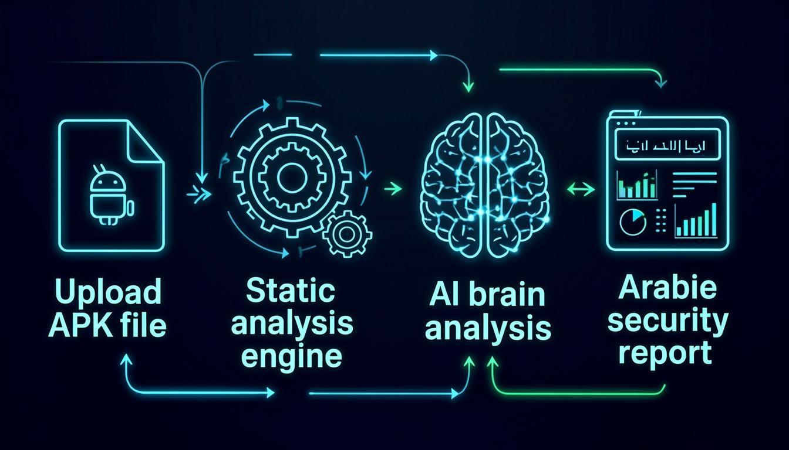
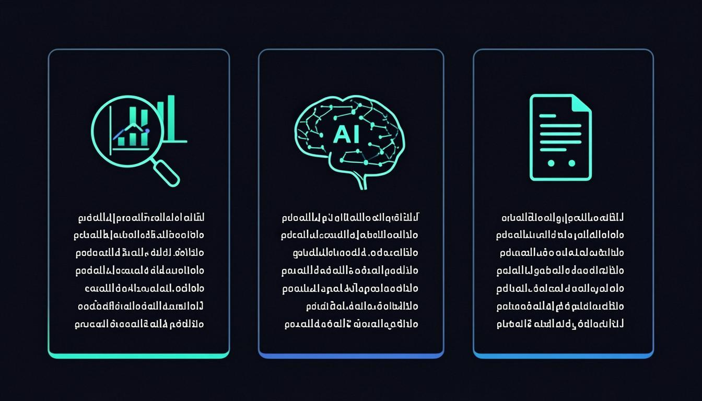
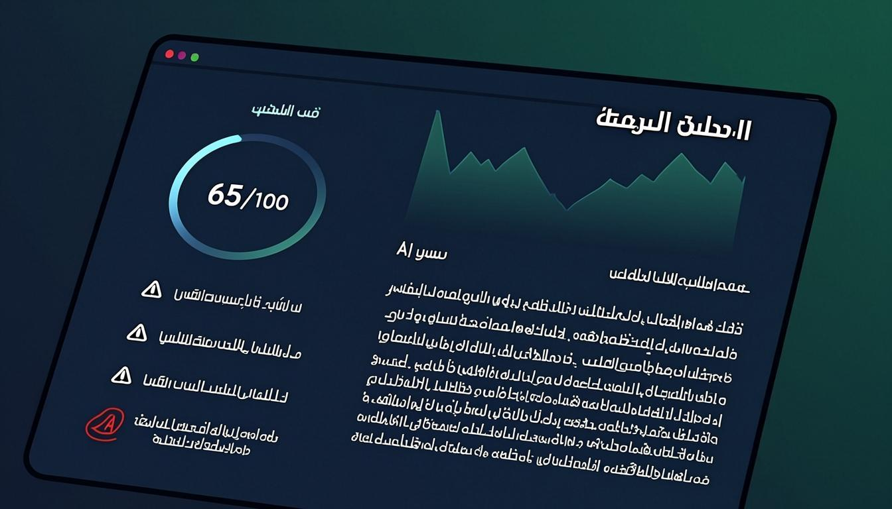

<div dir="rtl">

# حَارِس AI | Hares AI 🛡️

<p align="center">
  
</p>

<p align="center">
  <strong>منصة تحليل أمني ذكية لتطبيقات الهواتف باللغة العربية</strong>
</p>

<p align="center">
  <a href="#المميزات">المميزات</a> •
  <a href="#how-it-works">How It Works</a> •
  <a href="#installation">Installation</a> •
  <a href="#tech-stack">Tech Stack</a> •
  <a href="#license">License</a>
</p>

---

## 🎯 نبذة عن المشروع

حَارِس AI هي منصة متقدمة لتحليل تطبيقات Android بشكل ساكن (Static Analysis)، مع شرح النتائج باللغة العربية باستخدام الذكاء الاصطناعي. المشروع مصمم ليكون بديلاً عربياً لأدوات مثل MobSF، مع التركيز على تجربة المستخدم العربية.

> **⚠️ تنبيه قانوني:** هذه الأداة مخصصة للاستخدام التعليمي والاختبار الأمني القانوني فقط. لا يُسمح باستخدامها لتجاوز الحمايات أو أي أغراض غير قانونية.

---

## ✨ المميزات | Features

### 🔍 تحليل عميق
- استخراج وتحليل ملف AndroidManifest.xml
- كشف الصلاحيات الخطيرة وتصنيفها (عالي/متوسط/منخفض)
- اكتشاف نقاط الاتصال API (HTTP vs HTTPS)
- استخراج البيانات الحساسة المضمّنة (API Keys, Secrets, Tokens)
- تحديد المكتبات والإطارات المستخدمة

### 🧠 ذكاء اصطناعي
- شرح النتائج باللغة العربية
- تحليل مستوى الخطورة مع توضيحات واضحة
- توصيات أمنية مخصصة
- حكم نهائي شامل (آمن / يحتاج تحسين / خطير)

### 📄 تقارير شاملة
- تقارير HTML تفاعلية جاهزة للتحميل
- درجة خطورة شاملة (0-100)
- تصنيف لوني للمخاطر (أحمر/أصفر/أخضر)
- تصميم RTL عربي كامل

---

## 🔄 كيف يعمل | How It Works

<p align="center">
  
</p>

1. **رفع الملف** 📤 - اسحب وأفلت ملف APK أو اختر من جهازك
2. **التحليل الساكن** 🔍 - يتم استخراج المكونات والصلاحيات والثغرات تلقائياً
3. **تحليل الذكاء الاصطناعي** 🧠 - يقوم AI بشرح النتائج وتقديم التوصيات بالعربية
4. **عرض النتائج** 📊 - لوحة تحكم شاملة مع 7 أقسام تفصيلية
5. **تحميل التقرير** 📥 - حمّل تقرير HTML كاملاً للمشاركة أو الأرشفة

---

## 📸 لقطات الشاشة | Screenshots

<p align="center">
  
  
</p>

---

## 🛠️ التقنيات المستخدمة | Tech Stack

| التقنية | الاستخدام |
|---------|----------|
| **Next.js 16** | إطار العمل الرئيسي |
| **TypeScript 5** | لغة البرمجة |
| **Prisma ORM** | قاعدة البيانات (SQLite) |
| **Tailwind CSS 4** | التصميم والأنماط |
| **shadcn/ui** | مكونات واجهة المستخدم |
| **Framer Motion** | الحركات والتأثيرات |
| **Zustand** | إدارة الحالة |
| **z-ai-web-dev-sdk** | تكامل الذكاء الاصطناعي |

---

## 📦 التثبيت | Installation

### المتطلبات الأساسية
- Node.js 18+ أو Bun
- npm أو bun

### خطوات التثبيت

```bash
# استنساخ المستودع
git clone https://github.com/binnoma/hares-ai.git
cd hares-ai

# تثبيت التبعيات
bun install

# إعداد قاعدة البيانات
cp .env.example .env
bun run db:push

# تشغيل المشروع
bun run dev
```

افتح المتصفح على `http://localhost:3000`

---

## 📁 هيكل المشروع | Project Structure

```
hares-ai/
├── prisma/
│   └── schema.prisma          # مخطط قاعدة البيانات
├── src/
│   ├── app/
│   │   ├── api/
│   │   │   ├── analyze/       # API رفع وتحليل الملفات
│   │   │   ├── analyses/      # API استعلام نتائج التحليل
│   │   │   └── report/        # API إنشاء التقارير
│   │   ├── globals.css        # الأنماط العامة
│   │   ├── layout.tsx         # التخطيط الرئيسي (RTL)
│   │   └── page.tsx           # الصفحة الرئيسية
│   ├── components/ui/         # مكونات shadcn/ui
│   ├── lib/
│   │   ├── analyzer.ts        # محرك التحليل الساكن
│   │   ├── ai-analyzer.ts     # وحدة التحليل بالذكاء الاصطناعي
│   │   ├── db.ts              # اتصال قاعدة البيانات
│   │   ├── store.ts           # إدارة الحالة (Zustand)
│   │   └── utils.ts           # أدوات مساعدة
│   └── hooks/                 # React Hooks
├── public/
│   ├── logo.svg               # شعار المشروع
│   └── robots.txt
├── docs/
│   ├── images/                # صور التوثيق
│   └── Hares-AI-Project.pdf   # ملف PDF للمشروع
├── .gitignore
├── .env.example
├── LICENSE
└── README.md
```

---

## 🔒 الأمان | Security

- التحليل الساكن فقط (لا يتم تشغيل التطبيق)
- لا يتم تجاوز أي حمايات
- الملفات المرفوعة تُحذف بعد التحليل
- جميع البيانات مخزنة محلياً

---

## 🇦🇪 صنع بحب

<p align="center">
  صنع بحب ❤️ من الإمارات 🇦🇪<br/>
  من المطور: <a href="https://github.com/binnoma"><strong>binnoma@</strong></a>
</p>

---

## 📄 الرخصة | License

هذا المشروع مرخص تحت رخصة MIT - راجع ملف [LICENSE](LICENSE) للتفاصيل.

</div>
